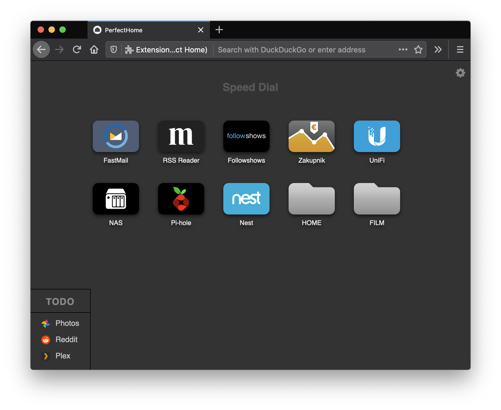
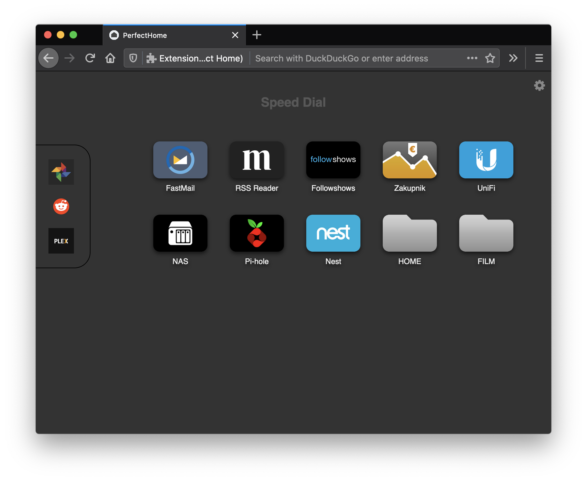

# Customization Tutorial

**Note:** This tutorial assumes basic knowledge of the CSS. If you need to ramp up - there are plenty of tutorials on the Internet (it's very easy).

----


**Perfect Home** allows for an infinite number of customizations, because it allows you to use CSS.

CSS class names are clear and have flat structure, so the properties can be easily overridden.

Let's say we start off with the default settings, and it looks like this:


We can restyle the "TODO" folder to look like a dock pinned to the left:


In order to check what we want to style, we need to open the Dev Tools (<kbd>cmd+alt+i</kbd> on mac, or <kbd>F12</kbd> on windows/linux).
Alternatively, we can right-click an element and select `Inspect Element` from the context menu.
That way we can get css class names of elements (folders, or bookmarks) and override their CSS style.

So let's grab the class name of a folder. In my case it's `folder-3iCqU8oJG6KW` (yours will be different, because the class name is composed of a bookmark ID, and firefox assigns unique IDs to bookmarks and folders).

Now, to style the folder we add something like the below to the  `Custom CSS` box in the `Perfect Home` settings:
```css
.folder-3iCqU8oJG6KW {
	position: fixed;
	top: 115px;
	left: 0;
	transform: none;
	border: 1px solid black;
	border-radius: 0 25px 25px 0;
	padding: 15px 5px 15px 0;
	margin: 0 0 0 -1px !important; /* margin is set by javascript, so `!important` is needed to overwrite it */
}
.folder-3iCqU8oJG6KW .folder-title,
.folder-3iCqU8oJG6KW .item-title,
.folder-3iCqU8oJG6KW .item-favicon { display: none; }
.folder-3iCqU8oJG6KW .item-thumb { padding: 10px; }
.folder-3iCqU8oJG6KW .item-thumb { display: block; width: 40px; height: 40px; }
.bookmarks { padding-left: 80px; }
```

And that's it - the effect should be visible immediately.


## Theming
The colour palette used throughout the UI is defined in CSS custom properties attached to `:root` element.
The few colours you can set in Settings panel are overwriting the defaults, and are also defined as CSS custom properties (with the same names as the default ones) and are attached to `HTML` tag selector.
If you wish to overwrite the colour palette, you just need to change the values for the CSS custom properties and attach them to `BODY` tag selector, like so:
```css
body {
    --color-text: red;
}
```

### Colour palette
Here is the full colour palette. To overwrite the colours, just copy the following snippet to the "Custom CSS" field in Settings and change the colour values.
```css
body {
	--color-border: #000;
	--color-background: #333;
	--color-background-alt: #444;

	--color-text: #fff;
	--color-text-dimmed: #ccc;

	--color-highlight: #14789f;
	--color-accen:t orange;

	--color-info: #666d7b;
	--color-success: #408062;
	--color-warning: #af8a1a;
	--color-danger: #8b4848;
}
```
